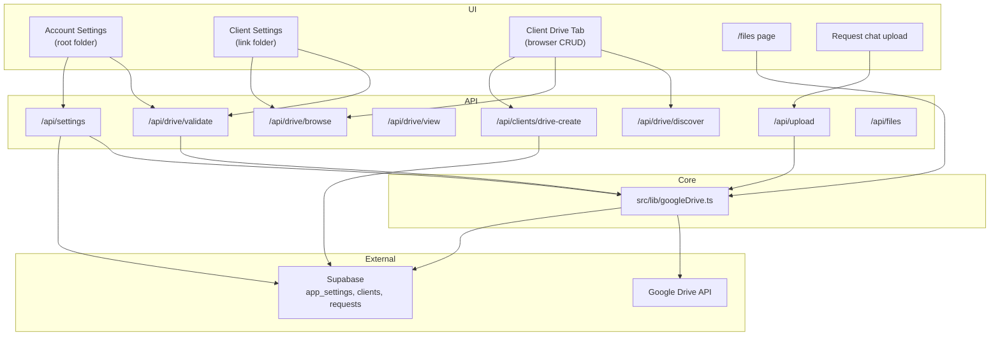

# Google Drive Feature — Build Spec for Agents

This document describes how the Google Drive integration works in **Aneerequest**, what must be configured, and which files/patterns to replicate when porting **only the Drive feature** into another project.

---

## 1. What the feature does

The Drive feature connects the app to a Google Drive account and uses a **folder hierarchy** for client project files.

| Surface | Who uses it | Purpose |
|--------|-------------|---------|
| **Account Settings** (`/account`) | `super_admin` | Set the global Drive root folder |
| **Client → Settings tab** | `super_admin` | Link/validate/remove a per-client Drive folder |
| **Client → Drive tab** | `super_admin` | Browse, upload, rename, delete files/folders inside the linked client folder |
| **Global Files page** (`/files`) | Staff | Browse the root folder tree (clients → requests → files) |
| **Request chat uploads** | Staff + clients | Attachments go to Drive (`production` or `distributed` subfolder) |
| **Request creation** | System | Auto-creates request folders on Drive when a request is created |

**Important:** Service accounts have **no personal Drive storage quota** and cannot upload files reliably. The app **prefers OAuth2 with a refresh token** tied to a real Gmail account that owns the storage.

---

## 2. Folder hierarchy

```
[Root Folder]                          ← app_settings.drive_root_folder_id OR GOOGLE_DRIVE_ROOT_FOLDER_ID
└── [Client Name or Organization]      ← auto-created OR clients.drive_folder_id (override)
    └── [Request Title]                ← auto-created; requests.drive_folder_id stores this folder
        ├── production/                ← staff uploads
        └── distributed/               ← client uploads
```

**Resolution rules** (`ensureFolderPath` in `src/lib/googleDrive.ts`):

1. If `clients.drive_folder_id` is set → use that as the client base (skip `Root > ClientName`).
2. Else → `getOrCreateFolder(rootId, clientName)` under the global root.
3. Under client base → `getOrCreateFolder(base, requestTitle)`.
4. Under request → `getOrCreateFolder(requestFolder, 'production' | 'distributed')`.

---

## 3. Environment variables

### Required (OAuth2 — recommended)

```env
GOOGLE_OAUTH_CLIENT_ID=          # Google Cloud OAuth client ID
GOOGLE_OAUTH_CLIENT_SECRET=      # Google Cloud OAuth client secret
GOOGLE_OAUTH_REFRESH_TOKEN=      # Long-lived refresh token for the storage-owner Gmail account
GOOGLE_DRIVE_ROOT_FOLDER_ID=     # Fallback root folder ID if DB setting is missing
```

### Fallback (not recommended for uploads)

```env
GOOGLE_SERVICE_ACCOUNT_KEY=      # JSON string of service account credentials
```

### App dependencies (already used by Drive)

```env
NEXT_PUBLIC_SUPABASE_URL=
NEXT_PUBLIC_SUPABASE_ANON_KEY=
SUPABASE_SERVICE_ROLE_KEY=       # API routes use service client for DB + Drive orchestration
```

### Auth priority in code

```ts
// src/lib/googleDrive.ts
if (GOOGLE_OAUTH_CLIENT_ID && GOOGLE_OAUTH_CLIENT_SECRET && GOOGLE_OAUTH_REFRESH_TOKEN) {
  // Use OAuth2 — PREFERRED
} else if (GOOGLE_SERVICE_ACCOUNT_KEY) {
  // Fallback — uploads may fail (no quota)
} else {
  throw new Error('No Google credentials found');
}
```

---

## 4. Google Cloud setup (one-time)

### 4.1 Create project + enable API

1. [Google Cloud Console](https://console.cloud.google.com/) → create/select project.
2. **APIs & Services → Library** → enable **Google Drive API**.

### 4.2 OAuth consent screen

1. **APIs & Services → OAuth consent screen**.
2. User type: **External** (or Internal if Workspace).
3. Add scope: `https://www.googleapis.com/auth/drive`.

### 4.3 OAuth client credentials

1. **APIs & Services → Credentials → Create Credentials → OAuth client ID**.
2. Type: **Web application** (or Desktop for local token generation).
3. Save `client_id` and `client_secret` → `GOOGLE_OAUTH_CLIENT_ID`, `GOOGLE_OAUTH_CLIENT_SECRET`.

### 4.4 Generate refresh token

Use OAuth Playground or a small script:

1. Authorize with scope `https://www.googleapis.com/auth/drive`.
2. Exchange authorization code for tokens.
3. Store the **refresh token** (not access token) in `GOOGLE_OAUTH_REFRESH_TOKEN`.

The Gmail account used here is the **Storage Owner**. All linked folders must be shared with this account as **Editor**.

### 4.5 Root folder

1. In Google Drive, create a top-level folder (e.g. `Aneerequest Files`).
2. Share it with the Storage Owner Gmail (Editor).
3. Copy folder ID from URL: `https://drive.google.com/drive/folders/FOLDER_ID`.
4. Set `GOOGLE_DRIVE_ROOT_FOLDER_ID` and/or save via Account Settings UI.

---

## 5. Database schema

Run `drive_settings_migration.sql` (or equivalent):

```sql
-- Key-value app settings
CREATE TABLE IF NOT EXISTS public.app_settings (
    key TEXT PRIMARY KEY,
    value TEXT NOT NULL,
    updated_at TIMESTAMPTZ DEFAULT now()
);

-- Seed root folder (replace with your folder ID)
INSERT INTO public.app_settings (key, value)
VALUES ('drive_root_folder_id', 'YOUR_ROOT_FOLDER_ID')
ON CONFLICT (key) DO NOTHING;

-- Per-client Drive folder override
ALTER TABLE public.clients
ADD COLUMN IF NOT EXISTS drive_folder_id TEXT DEFAULT NULL;

-- Per-request Drive folder (speeds up uploads)
ALTER TABLE public.requests
ADD COLUMN IF NOT EXISTS drive_folder_id TEXT DEFAULT NULL;
```

**Root folder resolution:** DB `app_settings.drive_root_folder_id` wins over `GOOGLE_DRIVE_ROOT_FOLDER_ID` env.

---

## 6. NPM dependency

```json
"googleapis": "^171.4.0"
```

---

## 7. Core library — `src/lib/googleDrive.ts`

Single module wrapping the Drive API. Key exports:

| Function | Purpose |
|----------|---------|
| `getRootFolderId()` | DB → env fallback |
| `validateFolderAccess(folderId)` | Check folder exists + OAuth user can access |
| `listSubFolders(folderId)` | Immediate child folders only |
| `listFolderContents(folderId)` | All files + folders (60s in-memory cache) |
| `findFolder(parentId, name)` | Exact name match |
| `findFolderFuzzy(parentId, name)` | Normalized/partial name match |
| `createFolder(parentId, name)` | Create subfolder |
| `getOrCreateFolder(parentId, name)` | Find or create |
| `ensureFolderPath(clientName, requestTitle, folder, clientFolderId?)` | Full path to `production`/`distributed` |
| `uploadFileToDrive(folderId, name, buffer, mimeType)` | Upload + set `anyone` reader permission |
| `renameFileInDrive` / `deleteFileFromDrive` | File CRUD |
| `renameFolderInDrive` / `deleteFolderFromDrive` | Folder CRUD (delete = trash) |
| `createGoogleFile(parentId, name, type)` | New Doc/Sheet/Slide/Form |
| `getFile(fileId)` | Stream file content (for preview proxy) |
| `clearDriveCache()` | Invalidate listing cache |

**Upload side effect:** After upload, files get `permissions.create({ role: 'reader', type: 'anyone' })` so links work without per-user sharing.

---

## 8. API routes

### 8.1 `/api/drive/validate` — POST

**Auth:** None (called from UI; relies on server credentials).

```json
// Request
{ "folderId": "https://drive.google.com/drive/folders/ABC123" }

// Response (success)
{
  "valid": true,
  "folderId": "ABC123",
  "folderName": "Client Folder",
  "subFolders": [{ "id": "...", "name": "..." }]
}
```

Extracts folder ID from URL (`/folders/ID`) or raw ID string.

**Used by:** Account root folder save, Client Settings "Validate & Link", auto-validate on page load.

---

### 8.2 `/api/drive/discover` — GET

**Auth:** `super_admin` only.

```
GET /api/drive/discover?name=Acme%20Corp
```

Searches **root folder** for a subfolder whose name exactly matches `name` (typically `client.organization`).

```json
{ "found": true, "folderId": "...", "folderName": "Acme Corp" }
```

**Used by:** Drive tab empty state — suggests "Link Now" if a matching folder exists.

---

### 8.3 `/api/drive/browse` — GET / POST / PATCH / DELETE

**Auth:** `super_admin` only.

| Method | Action |
|--------|--------|
| `GET ?folderId=` | List folder contents (mapped to UI-friendly `DriveItem[]`) |
| `POST` JSON `{ parentId, folderName, type? }` | Create folder or Google Workspace file |
| `POST` FormData `file` + `parentId` | Upload file |
| `PATCH` `{ id, newName, isFolder }` | Rename file or folder |
| `DELETE ?id=&isFolder=true\|false` | Delete (trash) file or folder |

**Used by:** Client Drive tab browser (primary CRUD surface).

---

### 8.4 `/api/drive/view` — GET

**Auth:** Any logged-in user (session cookie).

```
GET /api/drive/view?fileId=DRIVE_FILE_ID
```

Proxies file stream from Drive for in-app preview (`Content-Disposition: inline`).

---

### 8.5 `/api/clients/drive-create` — POST

**Auth:** Service client (no explicit role check in route — add if porting).

```json
{ "clientId": "uuid", "clientName": "John", "organization": "Acme Corp" }
```

1. `folderName = organization || clientName`
2. `getOrCreateFolder(rootId, folderName)`
3. `UPDATE clients SET drive_folder_id = folderId`

**Used by:** Drive tab → "Create New Folder".

---

### 8.6 `/api/clients` — PATCH

Updates `drive_folder_id` on client (link/unlink folder).

```json
{ "id": "client-uuid", "drive_folder_id": "folder-id-or-empty-string" }
```

---

### 8.7 `/api/settings` — GET / PATCH

- `GET` → all `app_settings` as key-value object.
- `PATCH { key: "drive_root_folder_id", value: "url-or-id" }` → validates folder, saves clean ID.

**Used by:** Account page root folder management.

---

### 8.8 `/api/upload` — POST

**Auth:** Service client.

FormData: `file`, optional `requestId`, `taskId`, `senderId`.

| Context | Destination |
|---------|-------------|
| `requestId` present | Google Drive → `production` (staff) or `distributed` (client role) |
| `taskId` only | Supabase Storage `chat-attachments` bucket (not Drive) |

**Drive upload fast path:** If `requests.drive_folder_id` exists, only resolves `production`/`distributed` subfolder under it (skips full path walk).

Returns:

```json
{ "url": "...", "name": "...", "type": "...", "drive_file_id": "..." }
```

---

### 8.9 `/api/files` — GET / POST / PATCH / DELETE

Global files sidebar/tree:

- **GET** — Builds live tree from Drive root + enriches with DB clients/requests; role-filtered.
- **POST** — Upload to request folder via `ensureFolderPath` + insert `request_messages` attachment.
- **PATCH** — Rename attachment in DB + `renameFileInDrive`.
- **DELETE** — Remove attachment from DB + `deleteFileFromDrive`.

---

### 8.10 `/api/requests` — POST (on create)

When `create_folder !== false`:

1. `ensureFolderPath` for both `production` and `distributed`.
2. Find request folder ID → save to `requests.drive_folder_id`.

---

## 9. Client Drive tab — UI flow

**Files:** `src/components/clients/ClientDriveTab.tsx` (presentation) + logic in `src/app/(dashboard)/clients/[slug]/ClientPageClient.tsx`.

### 9.1 On client page load

```
IF client.drive_folder_id exists:
  POST /api/drive/validate → get folder name
  GET /api/drive/browse?folderId=... → auto-open browser

ELSE IF client.organization exists:
  GET /api/drive/discover?name=organization → show "Link Now" if found
```

### 9.2 Empty state (no folder linked)

User can:

1. **Create New Folder** → `POST /api/clients/drive-create` → browse into new folder.
2. **Link Existing Folder** → switches to Settings tab → paste URL/ID → **Validate & Link**.
3. **Link Now** (if discover found a match) → `PATCH /api/clients` with `drive_folder_id`.

### 9.3 Browsing state (`isDriveBrowsing === true`)

- Grid/list view of folders + files.
- Click folder → `navigateToDriveSubfolder` → append breadcrumb → `GET /api/drive/browse`.
- Click file → open preview modal (`previewUrl: /api/drive/view?fileId=...`).
- Context menu: rename, delete, download, open in Drive.
- Toolbar (in parent): upload file, new folder, new Google Doc/Sheet/Slide/Form.

### 9.4 Settings tab folder management

- Shows linked folder name + ID.
- **Validate & Link** → validate → `PATCH /api/clients`.
- **Remove link** → `drive_folder_id: ''` → falls back to global root path for future uploads.
- **Browse** button → switches to Drive tab.

---

## 10. Auth & permissions summary

| Route / action | Required role |
|----------------|---------------|
| `/api/drive/browse` CRUD | `super_admin` |
| `/api/drive/discover` | `super_admin` |
| `/api/drive/validate` | No user check (server credentials) |
| `/api/drive/view` | Any authenticated user |
| Account root folder UI | `super_admin` |
| Client Drive tab | Effectively `super_admin` (browse API gated) |

**Drive folder sharing rule:** Every folder ID stored in the app (root, client override) must be shared with the OAuth Storage Owner Gmail as **Editor**.

---

## 11. Data model (TypeScript shapes)

```ts
// Drive item returned by /api/drive/browse
interface DriveItem {
  id: string;
  name: string;
  mimeType: string;
  isFolder: boolean;
  size: number | null;
  createdTime: string;
  webViewLink: string;
  webContentLink: string | null;
  previewUrl?: string | null;  // /api/drive/view?fileId=... for files
}

// Client record (relevant fields)
interface Client {
  id: string;
  name: string;
  organization?: string;
  drive_folder_id?: string | null;
}

// Request record (relevant fields)
interface Request {
  id: string;
  title: string;
  client_id: string;
  drive_folder_id?: string | null;
}
```

---

## 12. Architecture diagram



---

## 13. Files to port (minimal Drive feature)

Copy or reimplement these in order:

### Layer 1 — Foundation
1. `src/lib/googleDrive.ts` — core Drive wrapper
2. `drive_settings_migration.sql` — DB schema
3. Env vars (section 3) + Google Cloud setup (section 4)

### Layer 2 — API routes
4. `src/app/api/drive/validate/route.ts`
5. `src/app/api/drive/discover/route.ts`
6. `src/app/api/drive/browse/route.ts`
7. `src/app/api/drive/view/route.ts`
8. `src/app/api/clients/drive-create/route.ts`
9. `src/app/api/settings/route.ts` (at least `drive_root_folder_id` handling)
10. `src/app/api/upload/route.ts` (request → Drive branch)
11. `src/app/api/clients/route.ts` — PATCH must accept `drive_folder_id`

### Layer 3 — UI
12. `src/components/clients/ClientDriveTab.tsx`
13. Drive state + handlers in client page (see `ClientPageClient.tsx` lines ~295–721)
14. `src/components/clients/ClientSettingsTab.tsx` — Drive Storage section
15. `src/app/(dashboard)/account/page.tsx` — root folder section (optional but recommended)

### Layer 4 — Optional integrations
16. `src/lib/data/files.ts` + `src/app/(dashboard)/files/page.tsx` + `src/components/FilesClient.tsx` — global file browser
17. `src/app/api/files/route.ts` — files sidebar CRUD
18. `src/app/api/requests/route.ts` — auto-create folders on request create

---

## 14. Implementation checklist for a new project

- [ ] Install `googleapis`
- [ ] Set OAuth env vars + create root folder in Drive
- [ ] Run DB migration (`app_settings`, `clients.drive_folder_id`, `requests.drive_folder_id`)
- [ ] Port `googleDrive.ts` and verify `validateFolderAccess(rootId)` succeeds
- [ ] Implement `/api/drive/validate` and `/api/settings` PATCH for root folder
- [ ] Implement `/api/drive/browse` with `super_admin` guard
- [ ] Implement `/api/clients/drive-create` + client PATCH for `drive_folder_id`
- [ ] Build Client Drive tab UI (empty state → browse → CRUD)
- [ ] Wire request chat upload to `/api/upload` with `requestId`
- [ ] (Optional) Auto-create request folders on request POST
- [ ] Share all linked folders with Storage Owner Gmail as Editor
- [ ] Test: create client folder → upload file → preview → rename → delete

---

## 15. Troubleshooting

| Symptom | Likely cause |
|---------|--------------|
| `Access Denied` / 404 on validate | Folder not shared with Storage Owner Gmail |
| `invalid_grant` on validate | Refresh token revoked or OAuth client mismatch |
| Upload fails with service account | Switch to OAuth2 (service accounts lack quota) |
| File not in expected folder | Client has `drive_folder_id` override — check Settings tab |
| Browse returns 403 | User is not `super_admin` |
| Old clients in wrong root | Changing root only affects **new** paths; move folders manually or relink clients |

---

## 16. Related doc

`GOOGLE_DRIVE_SETUP.md` — shorter operational guide for admins (permissions, root/client folder rules, troubleshooting). Use **this file** (`GOOGLE_DRIVE_FEATURE_SPEC.md`) when building or porting the feature in code.
